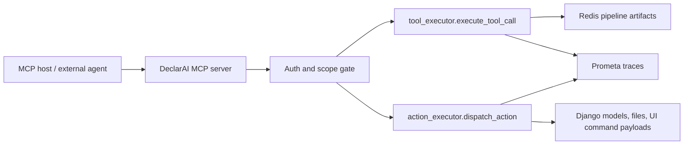

# DeclarAI Assistant Tools and MCP Integration Guide

Last verified: 2026-06-14

This document describes the tool and action surface exposed by the DeclarAI Auto-ML assistant, then proposes an MCP server wrapper for external agent platforms.

Primary local sources:

- `backend/ai_assistant/tool_definitions.py`
- `backend/ai_assistant/tool_executor.py`
- `backend/ai_assistant/action_executor.py`
- `backend/ai_assistant/views.py`
- `frontend/src/app/services/data.service.ts`
- `docs/knowledge-bank/assistant-usage-and-action-guide.md`

External protocol sources:

- [MCP tools specification, latest 2025-11-25](https://modelcontextprotocol.io/specification/2025-11-25/server/tools)
- [MCP transports specification, latest 2025-11-25](https://modelcontextprotocol.io/specification/2025-11-25/basic/transports)
- [MCP authorization specification, latest 2025-11-25](https://modelcontextprotocol.io/specification/2025-11-25/basic/authorization)
- [Official MCP Python SDK](https://github.com/modelcontextprotocol/python-sdk)

## Integration Model

DeclarAI has two agent-facing layers:

1. Chat-time tools: read current pipeline state and stable skill content during an LLM turn. These are OpenAI-style function tools registered in `PIPELINE_TOOLS` and executed by `execute_tool_call(file_id, tool_name, arguments)`.
2. Applyable actions: mutate data, metadata, configuration, notes, or run pipeline steps after the assistant emits an `<<<ACTION:...>>>` block and the user clicks Apply. These are dispatched by `dispatch_action(file_id, action_type, payload, parent_span_id=None)`.

Inside the current web app, `file_id` is implicit: the chat endpoint and action endpoint know which uploaded declaration is active. For external integrations, including MCP, `file_id` should be explicit on every pipeline tool call unless the server implements authenticated session binding.

## Current Runtime Flow

Chat inspection flow:

1. Frontend sends a chat request with message, context, history, optional model, optional intent labels, and `file_id`.
2. Backend builds slim context and gives the model `PIPELINE_TOOLS`.
3. If the model calls a tool, backend calls `execute_tool_call(file_id, tool_name, arguments)`.
4. The handler reads Redis or static catalogs and returns text to the model.
5. The final assistant message may include zero or more `<<<ACTION:...>>>` blocks.

Action execution flow:

1. Frontend parses action blocks into `{ type, payload }`.
2. User clicks Apply.
3. Frontend posts `{ file_id, action_type, payload, parent_span_id? }` to `/ai-assistant/execute-action/`.
4. Backend calls `dispatch_action(...)`.
5. The specific action handler validates input, applies server-side changes or returns a validated frontend command.
6. Frontend updates UI state or starts the corresponding pipeline run.

## Chat-Time Tool Catalog

All tools below are model-callable in chat. In the existing app, `file_id` is supplied by backend context. In MCP, add `file_id: integer` to each pipeline-specific tool.

| Tool | Parameters | Purpose |
|---|---|---|
| `get_split_validation` | none | Train/test/full split counts, target counts, target means. |
| `get_dq_summary` | optional `feature: string` | Data-quality rows with PSI, CSI, missingness, variable type, and decision flags. |
| `get_feature_stats` | required `feature: string` | Before/after preprocessing descriptive stats for one feature. |
| `get_vif_decomposition` | required `feature: string` | Correlation/VIF decomposition for one feature. |
| `get_encoding_plan` | none | Categorical encoding plan, level of measurement, cardinality, primary/fallback strategy. |
| `get_selected_features` | optional `top_n: integer` | Selected features with score, SHAP percentile, gain percentile, VIF, and usage. |
| `get_shap_details` | optional `top_n: integer` | SHAP impact rows for selected features. |
| `get_sfs_results` | optional `direction: "forward"`, `"backward"`, or `"forward_from_backward"` | Sequential Feature Selection config, status, and step rows. |
| `get_cv_results` | none | Cross-validation ROC-AUC, PR-AUC, folds, per-fold and PR-curve summary. |
| `get_pipeline_notes` | none | User-authored pipeline notes. |
| `get_pipeline_config` | none | Target, pipeline type, split strategy, purifier steps, row/column counts, model exclusions. |
| `get_purifier_options` | optional `kind` enum | Static catalog of 34 data-purifier options and IDs. |
| `get_data_dictionary` | optional `feature: string` | Feature dictionary, descriptions, data types, unique counts, measurement levels, usage. |
| `invoke_skill` | required `skill_name: string` | Load a bundled assistant skill body. |
| `get_skill_file` | required `skill_name: string`, `path: string` | Read an allowed supplementary skill file. |

Valid `get_purifier_options.kind` values:

- `col_dedup`
- `row_dedup`
- `zero_var_drop`
- `perfect_corr_drop`
- `corr_drop`
- `sparsity_drop`
- `missing_drop`
- `combined_drop`
- `outlier_quantile_clip`
- `cat_outlier_merge`

The current bundled skill is `feature-engineering`, with supplementary references, scripts, and templates under `backend/ai_assistant/skills/feature-engineering/`.

## Applyable Action Catalog

These actions are not regular read-only tools. They are proposed by the assistant, then executed through the action endpoint. External integrations should preserve the same review/approval semantics.

| Action | Payload | Risk class |
|---|---|---|
| `execute_code` | `code: string`, optional `description` | High. Mutates dataset through sandboxed pandas/numpy code. |
| `update_metadata` | `updates: [{ column, field, value }]`, optional `description` | Medium. Updates data dictionary or frontend metadata patches. |
| `update_config` | `updates: [{ key, value, column?, reason? }]`, optional `description` | Medium. Changes modeling/pipeline decisions. |
| `set_ordinal_ranking` | `updates: [{ column, ranking: string[] }]`, optional `description` | Medium. Sets ordinal rank order and implied LoM change. |
| `start_sfs` | `methods`, `stopping_criteria`, optional `excluded_features`, `n_jobs`, `top_k`, `backward_cut_step`, `description` | High. Starts a compute process. |
| `start_data_purifier` | optional `purifier_options`, optional `split`, optional `description` | High. Starts preprocessing and creates downstream artifacts. |
| `update_purifier_selection` | either `purifier_options` or `add`/`remove`, optional `description` | Medium. Edits UI selection without running preprocessing. |
| `apply_encoding` | optional `use_native: boolean`, optional `description` | High. Starts encoding and creates downstream artifacts. |
| `start_modeling` | optional `algorithm: string`, optional `encoding_use_native: boolean`, optional `description` | High. Starts model training. |
| `start_hyperparameter` | optional search and parameter-space fields, optional `description` | High. Starts tuning compute after SFS. |
| `update_notes` | `action`, `position`, `content`, optional `description` | Low. Changes user-facing notes. |

## Action Payload Details

### `execute_code`

```json
{
  "code": "df['Debt_to_Income'] = df['Debt'] / df['Income'].replace(0, np.nan)",
  "description": "Create a debt-to-income ratio"
}
```

Sandbox notes:

- `df`, `pd`, and `np` are available.
- `import` lines are stripped.
- Dangerous builtins such as `open`, `exec`, `eval`, `compile`, and `__import__` are unavailable.
- The handler backs up the file, validates structural integrity, saves, verifies reload, and updates data dictionary rows for new/deleted columns.

### `update_metadata`

```json
{
  "updates": [
    {
      "column": "Var_1",
      "field": "Feature_Description",
      "value": "Number of credit-card applications last month"
    }
  ],
  "description": "Clarify Var_1"
}
```

Supported fields in the assistant prompt include `Feature_Description`, `Level_of_Measurement`, `Data_Type`, and `Model_Usage_YN`.

### `update_config`

```json
{
  "updates": [
    {
      "key": "feature_usage",
      "column": "Var_3",
      "value": "drop",
      "reason": "High VIF"
    }
  ],
  "description": "Drop Var_3 from SFS without deleting the column"
}
```

Known keys include:

- `model_usage`: requires `column`, value `"Yes"` or `"No"`.
- `feature_usage`: requires `column`, value `"keep"` or `"drop"`, optional `reason`.
- `preprocessing_options`
- `split_strategy`
- `split_date_column`
- `split_cutoff`
- `encoding_strategy`
- `algorithm`

### `set_ordinal_ranking`

```json
{
  "updates": [
    {
      "column": "Risk_Band",
      "ranking": ["low", "medium", "high"]
    }
  ],
  "description": "Encode risk band as an ordinal signal"
}
```

Validation rules:

- `updates` must be a non-empty list.
- Each update needs a non-empty `column` and `ranking`.
- `ranking` must contain at least two unique values.
- Values are coerced to strings.
- A successful ranking automatically implies `Level_of_Measurement = "ordinal"`.

### `start_sfs`

```json
{
  "methods": ["backward"],
  "stopping_criteria": {
    "metrics": [
      { "metric": "roc_auc", "pct_change": 1.0 }
    ],
    "min_features": 5,
    "max_features": 15
  },
  "excluded_features": ["Var_3"],
  "n_jobs": 3,
  "top_k": 5,
  "description": "Start backward SFS excluding Var_3"
}
```

Rules:

- `methods` must include `forward`, `backward`, or both.
- Metrics are `roc_auc` or `pr_auc`.
- `n_jobs` is clamped to `1..16`.
- `top_k` is clamped to `1..50`.
- `backward_cut_step` is allowed only when `methods` includes `forward` and completed backward results exist on disk.
- The handler refuses to start a duplicate run when SFS is already running.

### `start_data_purifier`

```json
{
  "purifier_options": [1, 2, 5, 7],
  "split": {
    "strategy": "random",
    "percent": 25
  },
  "description": "Run preprocessing with selected purifier options"
}
```

Rules:

- `purifier_options` is optional and contains integer IDs `1..34`.
- Missing or empty options means "use current UI selection".
- `split.strategy` is `random` or `oot`.
- `oot` requires `date_column`.
- `cutoff` must be an ISO datetime string if provided.

### `update_purifier_selection`

Wholesale form:

```json
{
  "purifier_options": [1, 2, 3, 4, 7, 23, 28, 32],
  "description": "Prepare purifier selection for review"
}
```

Diff form:

```json
{
  "add": [23],
  "remove": [11, 17],
  "description": "Replace separate sparsity and missing drops with combined drop"
}
```

Rules:

- Use exactly one form: `purifier_options` XOR `add`/`remove`.
- IDs must be in `1..34`.
- Wholesale form validates group conflicts.
- Diff form rejects IDs that appear in both `add` and `remove`.

### `apply_encoding`

```json
{
  "use_native": true,
  "description": "Apply encoding with the native encoder"
}
```

`use_native` defaults to `true` and accepts boolean-like strings.

### `start_modeling`

```json
{
  "algorithm": "lightgbm",
  "encoding_use_native": true,
  "description": "Start modeling with LightGBM"
}
```

Rules:

- `algorithm` is optional.
- If provided, it must be a non-empty string.
- `encoding_use_native` defaults to `true`.

### `start_hyperparameter`

```json
{
  "search_method": "auto",
  "grid_points_per_param": 5,
  "n_iter": 40,
  "cv_folds": 3,
  "n_jobs": 3,
  "primary_metric": "roc_auc",
  "validation_curve_points": 8,
  "enabled_params": ["max_depth", "learning_rate", "n_estimators"],
  "param_space": {
    "max_depth": {
      "type": "int",
      "min": 3,
      "max": 8,
      "log": false,
      "enabled": true
    }
  },
  "description": "Tune depth, learning rate, and tree count"
}
```

Rules:

- `search_method`: `auto`, `grid`, `random`, or `bayesian`.
- `grid_points_per_param`: clamped to `2..12`.
- `n_iter`: clamped to `2..500`.
- `cv_folds`: clamped to `2..10`.
- `n_jobs`: clamped to `1..32`.
- `validation_curve_points`: clamped to `2..25`.
- `primary_metric`: `roc_auc`, `pr_auc`, `f1`, `f2`, `precision`, `recall`, `accuracy`, or `mcc`.
- `enabled_params` and `param_space` are restricted to `n_estimators`, `max_depth`, `learning_rate`, `min_child_weight`, `subsample`, `colsample_bytree`, `gamma`, `reg_alpha`, and `reg_lambda`.
- The handler refuses to start a duplicate tuning run when tuning is already running.

### `update_notes`

```json
{
  "action": "add",
  "position": "after_data_dictionary",
  "content": "AI recommendation: review high-cardinality categoricals before encoding.",
  "description": "Add note after data dictionary"
}
```

Valid positions:

- `after_data_preview`
- `after_data_dictionary`
- `after_preprocessing_config`
- `after_purifier_summary`
- `after_data_quality`
- `after_encoding`
- `after_modeling_results`
- `after_sfs`

## MCP Server Proposal

MCP is a good fit for this surface because DeclarAI already has:

- tool schemas;
- deterministic server-side dispatch;
- Redis-backed pipeline artifact readers;
- Prometa spans around tool/action execution;
- explicit action validation and result objects.

The recommended architecture is a thin MCP facade over existing Python handlers, not a second implementation of pipeline logic.



### Transport Choice

Use both transports in stages:

1. Local/dev: stdio. This is easiest for local agent clients because the client launches the server as a subprocess.
2. Platform/enterprise: Streamable HTTP at `/mcp`. The current MCP spec requires one HTTP endpoint for POST/GET, strict Origin validation, authentication, session handling, and the negotiated `MCP-Protocol-Version` header.

Because this is a Python/Django repo, the best first implementation is the official Python SDK `mcp>=1.27,<2` with FastMCP. The current v1 SDK documents stdio and Streamable HTTP support, and v2 is still pre-release as of 2026-06-14.

### Tool Naming

Use a namespace to avoid collisions in multi-server clients:

- `declarai.get_data_dictionary`
- `declarai.get_dq_summary`
- `declarai.get_selected_features`
- `declarai.action.start_sfs`
- `declarai.action.update_config`

MCP tool names should stay within ASCII letters, numbers, underscores, hyphens, and dots.

### Context Strategy

Use explicit `file_id` for MVP.

```json
{
  "file_id": 123,
  "feature": "Var_17"
}
```

Session binding can come later:

- `declarai.select_file` sets a session default.
- subsequent calls can omit `file_id`.
- server rejects omitted `file_id` if no session default exists.

Explicit `file_id` is safer for stateless HTTP clients, easier to audit, and harder to confuse across projects.

### Read-Only MCP Tools

For every chat-time tool, register an MCP tool that:

1. validates `file_id`;
2. strips `file_id` from the argument object;
3. calls `execute_tool_call(file_id, original_tool_name, arguments)`;
4. returns a text result plus optional structured metadata.

Example wrapper:

```python
from mcp.server.fastmcp import FastMCP

from ai_assistant.tool_executor import execute_tool_call

mcp = FastMCP("DeclarAI Auto-ML")


@mcp.tool(name="declarai.get_data_dictionary")
def get_data_dictionary(file_id: int, feature: str | None = None) -> str:
    args = {}
    if feature:
        args["feature"] = feature
    return execute_tool_call(file_id, "get_data_dictionary", args)
```

### Write/Run MCP Tools

There are two viable patterns.

Recommended MVP: expose actions as "prepare" tools first.

```json
{
  "action_type": "start_sfs",
  "payload": { "...": "..." },
  "requires_approval": true
}
```

The MCP tool returns a validated action block or a validation result, but does not execute. The host app then shows the user the action and routes approval through existing `/ai-assistant/execute-action/`.

Production pattern: expose direct action tools with hard scope gates.

```python
@mcp.tool(name="declarai.action.update_notes")
def update_notes(file_id: int, payload: dict) -> dict:
    require_scope("declarai.notes.write")
    return dispatch_action(file_id, "update_notes", payload)
```

High-risk actions should require human confirmation in the MCP host before call execution:

- `execute_code`
- `start_data_purifier`
- `apply_encoding`
- `start_modeling`
- `start_sfs`
- `start_hyperparameter`

### Scope Model

Use separate OAuth/API-token scopes for read, write, and run permissions.

| Scope | Grants |
|---|---|
| `declarai.pipeline.read` | All `get_*`, `invoke_skill`, and `get_skill_file` tools. |
| `declarai.notes.write` | `update_notes`. |
| `declarai.metadata.write` | `update_metadata`, `set_ordinal_ranking`. |
| `declarai.config.write` | `update_config`, `update_purifier_selection`. |
| `declarai.dataset.write` | `execute_code`. |
| `declarai.pipeline.run` | `start_data_purifier`, `apply_encoding`, `start_modeling`, `start_sfs`, `start_hyperparameter`. |

For Streamable HTTP, follow MCP authorization guidance: treat the MCP server as a protected resource server, accept access tokens, publish protected-resource metadata, and keep tokens audience-bound to the MCP server.

### Approval and Risk Metadata

MCP tools are model-controlled, so the server should not rely on model judgment for safety. Add server-side risk metadata and audit attributes:

```json
{
  "risk": "high",
  "side_effects": true,
  "requires_confirmation": true,
  "scopes": ["declarai.pipeline.run"]
}
```

Even though clients may display tool annotations, the server must enforce scopes and validation itself.

### Observability

Reuse the existing Prometa instrumentation:

- `tool-call` spans for read tools;
- `cache-read:*` child spans for Redis reads;
- `declarai-action` workflow spans for actions;
- `declarai.action.parent_span_id` or MCP request id for causal linking;
- `declarai.mcp.client_id`, `declarai.mcp.session_id`, `declarai.mcp.tool_name`, and `declarai.mcp.approval_id` as new attributes.

The MCP server should log:

- authenticated principal;
- requested `file_id`;
- tool name;
- argument keys, not full sensitive values by default;
- result status;
- elapsed time;
- approval id for write/run actions.

### Suggested File Layout

```text
backend/ai_assistant/mcp_server/
  __init__.py
  server.py              # FastMCP app and tool registration
  schemas.py             # Pydantic payload models
  auth.py                # token/scope validation
  registry.py            # mapping from MCP names to internal names
  audit.py               # Prometa attrs + structured logs
  README.md              # local run and client config
```

### MVP Implementation Plan

1. Add `mcp>=1.27,<2` to backend dependencies.
2. Create a FastMCP server with read-only wrappers for the 15 chat-time tools.
3. Add explicit `file_id` to every MCP read tool schema.
4. Return both text content and structured `{ tool_name, file_id, ok }` metadata where useful.
5. Add a local stdio entry point for developer testing.
6. Test with MCP Inspector.
7. Add Streamable HTTP behind authenticated localhost-only dev config.
8. Add scope checks and origin validation before exposing beyond local dev.
9. Add "prepare action" tools for all 11 actions.
10. Add direct action tools only after the host approval UX is defined.

### Example MCP Read Tool Registry

```python
READ_TOOLS = {
    "declarai.get_split_validation": {
        "internal": "get_split_validation",
        "args": {},
    },
    "declarai.get_dq_summary": {
        "internal": "get_dq_summary",
        "args": {"feature": "Optional feature filter"},
    },
    "declarai.get_feature_stats": {
        "internal": "get_feature_stats",
        "args": {"feature": "Required feature name"},
    },
    "declarai.get_vif_decomposition": {
        "internal": "get_vif_decomposition",
        "args": {"feature": "Required feature name"},
    },
    "declarai.get_encoding_plan": {"internal": "get_encoding_plan", "args": {}},
    "declarai.get_selected_features": {
        "internal": "get_selected_features",
        "args": {"top_n": "Optional integer"},
    },
    "declarai.get_shap_details": {
        "internal": "get_shap_details",
        "args": {"top_n": "Optional integer"},
    },
    "declarai.get_sfs_results": {
        "internal": "get_sfs_results",
        "args": {"direction": "forward|backward|forward_from_backward"},
    },
    "declarai.get_cv_results": {"internal": "get_cv_results", "args": {}},
    "declarai.get_pipeline_notes": {"internal": "get_pipeline_notes", "args": {}},
    "declarai.get_pipeline_config": {"internal": "get_pipeline_config", "args": {}},
    "declarai.get_purifier_options": {
        "internal": "get_purifier_options",
        "args": {"kind": "Optional purifier kind"},
    },
    "declarai.get_data_dictionary": {
        "internal": "get_data_dictionary",
        "args": {"feature": "Optional feature filter"},
    },
    "declarai.invoke_skill": {
        "internal": "invoke_skill",
        "args": {"skill_name": "Required skill name"},
    },
    "declarai.get_skill_file": {
        "internal": "get_skill_file",
        "args": {"skill_name": "Required", "path": "Required relative path"},
    },
}
```

### Example Direct Action Wrapper

```python
from ai_assistant.action_executor import dispatch_action


@mcp.tool(name="declarai.action.start_modeling")
def start_modeling(
    file_id: int,
    algorithm: str | None = None,
    encoding_use_native: bool = True,
    description: str = "",
) -> dict:
    require_scope("declarai.pipeline.run")
    require_approval("start_modeling", file_id)
    payload = {
        "algorithm": algorithm,
        "encoding_use_native": encoding_use_native,
        "description": description,
    }
    return dispatch_action(file_id, "start_modeling", payload)
```

### Open Questions Before Direct Execution

- Which host will call this MCP server first: internal Prometa Builder, Claude Desktop, Codex, or a customer-owned agent platform?
- Should external agents be allowed to mutate customer datasets, or should they only prepare action blocks for the DeclarAI UI?
- Where should approval live: MCP host, DeclarAI web UI, or both?
- Should `file_id` be globally visible to external clients, or should the MCP server expose a `list_accessible_files` tool with opaque IDs?
- Should action results stream progress for long-running jobs, or should the MCP server return a run id and expose `get_run_status`?

## Recommendation

Ship the MCP integration in two phases:

1. Read-only MCP server: expose the 15 current chat-time tools with explicit `file_id`, auth, rate limits, and Prometa tracing.
2. Governed action MCP server: start with "prepare action" tools, then selectively enable direct execution for low-risk actions (`update_notes`, maybe `update_purifier_selection`) before high-risk compute and dataset mutation actions.

This preserves the platform's current safety model while making the same tool surface portable to any MCP-compatible agent host.

## Implemented Server

The repository includes a FastMCP-based server under:

```text
backend/ai_assistant/mcp_server/
```

Run it from the backend directory with stdio transport:

```bash
python manage.py run_mcp_server
```

Run it as a local Streamable HTTP server:

```bash
python manage.py run_mcp_server --transport streamable-http --host 127.0.0.1 --port 8000
```

MCP Inspector can connect to:

```text
http://127.0.0.1:8000/mcp
```

The server registers:

- `declarai.get_*` read tools for the existing assistant inspection surface.
- `declarai.prepare.*` action-preparation tools that return reviewable DeclarAI action blocks without mutating state.
- `declarai.action.*` direct-execution tools only when explicitly enabled.

Default scopes:

```text
declarai.pipeline.read,declarai.action.prepare
```

Enable direct side-effecting action tools only for a controlled deployment:

```bash
export DECLARAI_MCP_ENABLE_DIRECT_ACTIONS=true
export DECLARAI_MCP_SCOPES=declarai.pipeline.read,declarai.action.prepare,declarai.notes.write,declarai.metadata.write,declarai.config.write,declarai.dataset.write,declarai.pipeline.run
python manage.py run_mcp_server --transport streamable-http --direct-actions
```

Direct action calls require `approval_id` by default. For trusted local-only automation, this can be disabled with:

```bash
export DECLARAI_MCP_REQUIRE_APPROVAL=false
```

### Prometa Binding Contract

Current recommended shape for the POC is Prometa on-prem or same-network
Prometa connected to an internal DeclarAI Streamable HTTP endpoint:

```bash
python manage.py run_mcp_server --transport streamable-http --host 0.0.0.0 --port 8000
```

For Prometa SaaS, put this endpoint behind public HTTPS with MCP-aware OAuth or
an equivalent resource-server gateway before registering it in Prometa. The
Django management command is the MCP application surface; production internet
exposure should add TLS termination, Origin validation, token audience checks,
and per-agent scopes at the ingress layer.

The server publishes governance metadata in two ways:

- every MCP `Tool` has `_meta` keys such as `declarai.required_scopes`,
  `declarai.risk`, `declarai.side_effects`, `declarai.destructive`,
  `declarai.approval_required`, and `declarai.guardrails_required`;
- `declarai.get_mcp_tool_catalog` returns the same metadata as a structured
  catalog for hosts that do not consume custom `Tool._meta`.

Read-only tools:

```text
declarai.get_mcp_tool_catalog
declarai.get_split_validation
declarai.get_dq_summary
declarai.get_feature_stats
declarai.get_vif_decomposition
declarai.get_encoding_plan
declarai.get_selected_features
declarai.get_shap_details
declarai.get_sfs_results
declarai.get_cv_results
declarai.get_pipeline_notes
declarai.get_pipeline_config
declarai.get_purifier_options
declarai.get_data_dictionary
declarai.invoke_skill
declarai.get_skill_file
```

Required scope for all read-only tools:

```text
declarai.pipeline.read
```

Prepare-action tools are review-only. They return DeclarAI action blocks but do
not mutate data, metadata, config, notes, or pipeline state. They are annotated
as read-only, non-destructive, and idempotent. Required scope for every
`declarai.prepare.*` tool:

```text
declarai.action.prepare
```

Direct action tools are only registered when both are true:

```bash
export DECLARAI_MCP_ENABLE_DIRECT_ACTIONS=true
python manage.py run_mcp_server --direct-actions
```

Direct action scope map:

| MCP tool | Scope | Risk | Destructive | Mandatory guardrails |
| --- | --- | --- | --- | --- |
| `declarai.action.execute_code` | `declarai.dataset.write` | high | yes | human approval, risk gate, dataset backup |
| `declarai.action.update_metadata` | `declarai.metadata.write` | medium | no | human approval |
| `declarai.action.update_config` | `declarai.config.write` | medium | no | human approval |
| `declarai.action.set_ordinal_ranking` | `declarai.metadata.write` | medium | no | human approval |
| `declarai.action.start_sfs` | `declarai.pipeline.run` | high | no | human approval, risk gate |
| `declarai.action.start_data_purifier` | `declarai.pipeline.run` | high | no | human approval, risk gate |
| `declarai.action.update_purifier_selection` | `declarai.config.write` | medium | no | human approval |
| `declarai.action.apply_encoding` | `declarai.pipeline.run` | high | no | human approval, risk gate |
| `declarai.action.start_modeling` | `declarai.pipeline.run` | high | no | human approval, risk gate |
| `declarai.action.start_hyperparameter` | `declarai.pipeline.run` | high | no | human approval, risk gate |
| `declarai.action.update_notes` | `declarai.notes.write` | low | no | human approval |

Annotation contract:

- read tools: `readOnlyHint=true`, `destructiveHint=false`,
  `idempotentHint=true`;
- prepare tools: `readOnlyHint=true`, `destructiveHint=false`,
  `idempotentHint=true`;
- direct action tools: `readOnlyHint=false`, `idempotentHint=false`, and
  `destructiveHint=true` only for `declarai.action.execute_code`.

MCP observability spans:

- `declarai-mcp-catalog` for governance catalog calls;
- `declarai-mcp-read-tool` for read tool calls;
- `declarai-mcp-prepare-action` for review-only action preparation;
- `declarai-mcp-direct-action` for side-effecting action execution;

The emitted attributes include `declarai.mcp.operation`,
`declarai.mcp.tool_name`, `declarai.mcp.file_id`, `declarai.mcp.action_type`,
`declarai.mcp.required_scopes`, `declarai.mcp.risk`,
`declarai.mcp.side_effects`, `declarai.mcp.destructive`,
`declarai.mcp.approval_id`, `declarai.mcp.ok`,
`declarai.mcp.result_chars`, and elapsed timing attributes.

Optional deployment labels can be supplied with:

```bash
export DECLARAI_MCP_CLIENT_ID=prometa-builder
export DECLARAI_MCP_SESSION_ID=prometa-sync-session
export DECLARAI_MCP_TRANSPORT=streamable-http
```

Settled runtime boundary: Prometa discovers, governs, signs, and observes;
DeclarAI runs. Prometa does not call DeclarAI `tools/call`. DeclarAI executes
approved MCP operations from the signed Prometa bundle next to the MCP host.
The DeclarAI-owned on-prem runner foundation lives in
`backend/ai_assistant/prometa_runner/` and is documented in
[`docs/prometa-onprem-bundle-runner.md`](prometa-onprem-bundle-runner.md).
